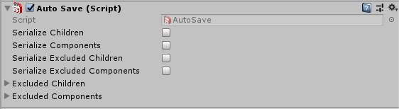
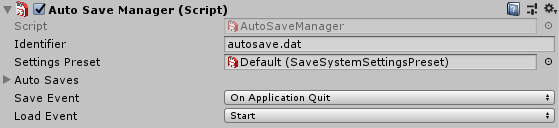

# Auto Save

The auto save feature allows you to save and load data without using the programatic interface.

## Auto Save Component

Tha auto save component allows you to control the serialization behaviour of a GameObject, such as serializing components or children, excluding specific children or components.

## Auto Save Manager

The Auto Save Manager component holds a list of all the Auto Save components available in the scene, so you can save the GameObjects with Auto Save copmponent easily by calling the Save method on Auto Save Manager or use save event to do it at specific time, such as OnApplicationQuit, OnApplicationPause, OnDisable or OnDestroy and then load it back by calling Load manually or using an event like Start, Awake or OnEnable.

