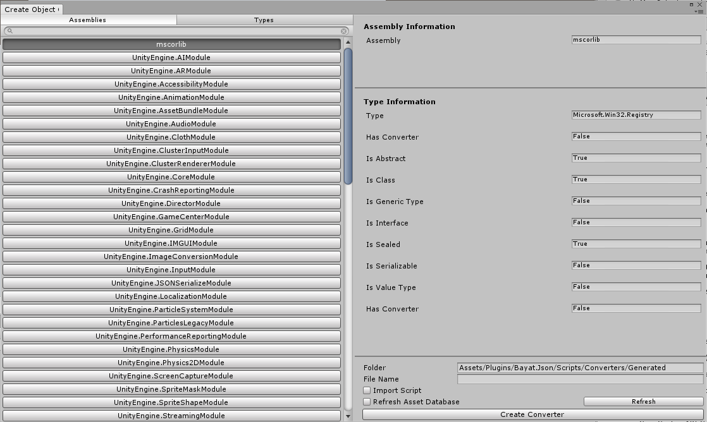

# Converter

A converter takes full control of the serialization of an object, this means you can exclude fields, properties or even include additional fields, properties or data, or take control of the object instantiation as well.

There are a few possible ways to create a converter, the first recommended way is through extending the [`ObjectJsonConverter`](xref:Bayat.Json.Converters.ObjectJsonConverter), a more deep and complex approach is by extending the [`JsonConverter`](xref:Bayat.Json.JsonConverter).

The main difference between the two is that [`ObjectJsonConverter`](xref:Bayat.Json.Converters.ObjectJsonConverter) handles the meta properties of the JSON, but the [`JsonConverter`](xref:Bayat.Json.JsonConverter) doesn't handle meta properties, which you should do it manually or ignore them.

## ObjectJsonConverter

An [`ObjectJsonConverter`](xref:Bayat.Json.Converters.ObjectJsonConverter) lets you control the serialization of an object completely, you can do it by extending the [`ObjectJsonConverter`](xref:Bayat.Json.Converters.ObjectJsonConverter) class, the below is an example of a converter which handles the serialization of the Transform component:

```csharp
using System;
using System.Collections;
using System.Collections.Generic;
using Bayat.Json.Serialization;
using UnityEngine;

namespace Bayat.Json.Converters
{

    public class TransformConverter : ObjectJsonConverter
    {

        public override string[] GetObjectProperties()
        {
            return new string[] { "position", "eulerAngles", "localEulerAngles", "right", "up", "forward", "rotation", "localRotation", "localScale", "parent", "hasChanged", "hierarchyCapacity", "hideFlags" };
        }

        public override bool CanConvert(Type objectType)
        {
            return objectType == typeof(UnityEngine.Transform);
        }

        public override void WriteProperties(JsonObjectContract contract, JsonWriter writer, object value, Type objectType, JsonSerializerWriter internalWriter)
        {
            var instance = (UnityEngine.Transform)value;
            internalWriter.SerializeProperty(writer, "position", instance.position);
            internalWriter.SerializeProperty(writer, "eulerAngles", instance.eulerAngles);
            internalWriter.SerializeProperty(writer, "localEulerAngles", instance.localEulerAngles);
            internalWriter.SerializeProperty(writer, "right", instance.right);
            internalWriter.SerializeProperty(writer, "up", instance.up);
            internalWriter.SerializeProperty(writer, "forward", instance.forward);
            internalWriter.SerializeProperty(writer, "rotation", instance.rotation);
            internalWriter.SerializeProperty(writer, "localRotation", instance.localRotation);
            internalWriter.SerializeProperty(writer, "localScale", instance.localScale);
            internalWriter.SerializeProperty(writer, "parent", instance.parent);
            writer.WriteProperty("hasChanged", instance.hasChanged);
            writer.WriteProperty("hierarchyCapacity", instance.hierarchyCapacity);
            internalWriter.SerializeProperty(writer, "hideFlags", instance.hideFlags);
        }

        public override object PopulateMember(string memberName, JsonContract contract, JsonReader reader, Type objectType, object targetObject, JsonSerializerReader internalReader)
        {
            var instance = (UnityEngine.Transform)targetObject;
            switch (memberName)
            {
                case "position":
                    instance.position = internalReader.DeserializeProperty<UnityEngine.Vector3>(reader);
                    break;
                case "eulerAngles":
                    instance.eulerAngles = internalReader.DeserializeProperty<UnityEngine.Vector3>(reader);
                    break;
                case "localEulerAngles":
                    instance.localEulerAngles = internalReader.DeserializeProperty<UnityEngine.Vector3>(reader);
                    break;
                case "right":
                    instance.right = internalReader.DeserializeProperty<UnityEngine.Vector3>(reader);
                    break;
                case "up":
                    instance.up = internalReader.DeserializeProperty<UnityEngine.Vector3>(reader);
                    break;
                case "forward":
                    instance.forward = internalReader.DeserializeProperty<UnityEngine.Vector3>(reader);
                    break;
                case "rotation":
                    instance.rotation = internalReader.DeserializeProperty<UnityEngine.Quaternion>(reader);
                    break;
                case "localRotation":
                    instance.localRotation = internalReader.DeserializeProperty<UnityEngine.Quaternion>(reader);
                    break;
                case "localScale":
                    instance.localScale = internalReader.DeserializeProperty<UnityEngine.Vector3>(reader);
                    break;
                case "parent":
                    instance.parent = internalReader.DeserializeProperty<UnityEngine.Transform>(reader);
                    break;
                case "hasChanged":
                    instance.hasChanged = reader.ReadProperty<System.Boolean>();
                    break;
                case "hierarchyCapacity":
                    instance.hierarchyCapacity = reader.ReadProperty<System.Int32>();
                    break;
                case "hideFlags":
                    instance.hideFlags = internalReader.DeserializeProperty<UnityEngine.HideFlags>(reader);
                    break;
                default:
                    reader.Skip();
                    break;
            }
            return instance;
        }

    }

}
```

You can also create a new converter by using the Create Object Converter window to initalize the boilerplate for your type and then modify it to your own desire, the window is available at **Window > Bayat > Json > Create Object Converter**.



## JsonConverter

The [`JsonConverter`](xref:Bayat.Json.JsonConverter) allows you to take full control on the serialization of an object, without any feature included, such as Meta properties, so you have to manually process them or ignore them, the below is an example of [`JsonConverter`](xref:Bayat.Json.JsonConverter) implementation of `Version` class:

```csharp
#region License
using System;
using System.Globalization;
using Bayat.Json.Serialization;
using Bayat.Json.Shims;
using Bayat.Json.Utilities;

namespace Bayat.Json.Converters
{

    /// <summary>
    /// Converts a <see cref="Version"/> to and from a string (e.g. "1.2.3.4").
    /// </summary>
    [Preserve]
    public class VersionConverter : JsonConverter
    {
        
        /// <summary>
        /// Writes the JSON representation of the object.
        /// </summary>
        /// <param name="writer">The <see cref="JsonWriter"/> to write to.</param>
        /// <param name="value">The value.</param>
        /// <param name="serializer">The calling serializer.</param>
        public override void WriteJson(JsonWriter writer, object value, JsonSerializerWriter internalWriter)
        {
            if (value == null)
            {
                writer.WriteNull();
            }
            else if (value is Version)
            {
                writer.WriteValue(value.ToString());
            }
            else
            {
                throw new JsonSerializationException("Expected Version object value");
            }
        }

        /// <summary>
        /// Reads the JSON representation of the object.
        /// </summary>
        /// <param name="reader">The <see cref="JsonReader"/> to read from.</param>
        /// <param name="objectType">Type of the object.</param>
        /// <param name="existingValue">The existing property value of the JSON that is being converted.</param>
        /// <param name="serializer">The calling serializer.</param>
        /// <returns>The object value.</returns>
        public override object ReadJson(JsonReader reader, Type objectType, object existingValue, JsonSerializerReader internalReader)
        {
            if (reader.TokenType == JsonToken.Null)
            {
                return null;
            }
            else
            {
                if (reader.TokenType == JsonToken.String)
                {
                    try
                    {
                        Version v = new Version((string)reader.Value);
                        return v;
                    }
                    catch (Exception ex)
                    {
                        throw JsonSerializationException.Create(reader, "Error parsing version string: {0}".FormatWith(CultureInfo.InvariantCulture, reader.Value), ex);
                    }
                }
                else
                {
                    throw JsonSerializationException.Create(reader, "Unexpected token or value when parsing version. Token: {0}, Value: {1}".FormatWith(CultureInfo.InvariantCulture, reader.TokenType, reader.Value));
                }
            }
        }

        /// <summary>
        /// Determines whether this instance can convert the specified object type.
        /// </summary>
        /// <param name="objectType">Type of the object.</param>
        /// <returns>
        /// 	<c>true</c> if this instance can convert the specified object type; otherwise, <c>false</c>.
        /// </returns>
        public override bool CanConvert(Type objectType)
        {
            return objectType == typeof(Version);
        }

    }

}
```