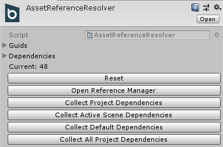
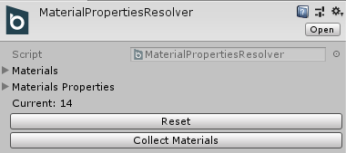
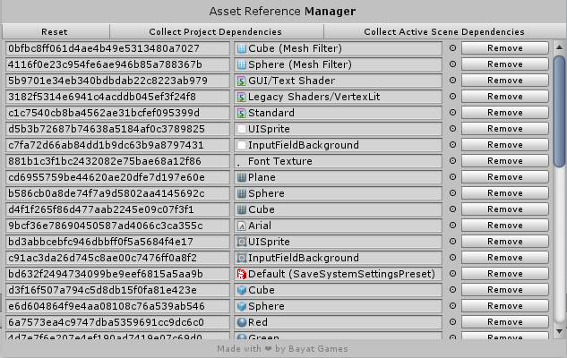

# Saving and Loading Assets

Using the [`AssetReferenceResolver`](xref:Bayat.Core.AssetReferenceResolver) you can easily save and load assets such as Materials, Textures or any other persistent Unity object by reference instead of serializing their values completely.



- **Collect Project Dependencies**: Collects the asset references from the scenes in the Build settings.
- **Collect Active Scene Dependencies**: Collects the current active scene asset references.
- **Collect Default Dependencies**: Collects all the default Unity assets references such as built-in resources, textures, materials, ...
- **Collect All Project Dependencies**: Collects whole project assets references, use it at your own risk because it references all project assets which might increase the build size by reference unused assets too and take more memory and reduce performance.

The [`MaterialPropertiesResolver`](xref:Bayat.Core.MaterialPropertiesResolver) holds a list of each material properties for easier runtime modification which is required for saving and loading Material properties at runtime.



You can also use the **Window > Bayat > Core > Asset Reference Manager** window for managing the asset references:



## Getting Started

The Asset Reference Resolver is available in the project by default and is limited to only 1 instance for the whole project, so you wouldn't have to create or do anything to set it up.

So you can easily use the Asset Reference Resolver API for saving and loading, the below code gets the GUID for the current GameObject Material if it is referenced by the Asset Reference Resolver, otherwise returns null:

```csharp
string guid = AssetReferenceResolver.Current.ResolveGuid(GetComponent<Renderer>().sharedMaterial);
```

```csharp
Object obj = AssetReferenceResolver.Current.ResolveReference(myGuid);
```