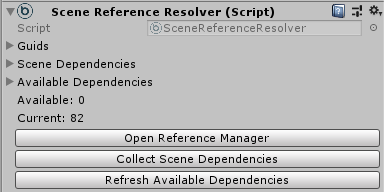
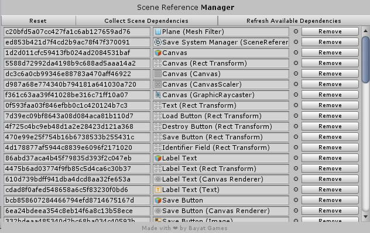

# Saving and Loading Scene Objects

Using the [`SceneReferenceResolver`](xref:Bayat.Core.SceneReferenceResolver) component you can easily save and load scene objects by reference instead of serializing their values completely.



You can also use the **Window > Bayat > Core > Scene Reference Manager** window for managing the scene references:



## Getting Started

First we should add the Scene Reference Resolver to the current scene:

- Right click on the hierarchy and use the **Bayat/Save System/Save System Manager** menu to create the Save System Manager component and all the required components.

- If you just want to create a single Scene Reference Resolver, use **Bayat/Core/Scene Reference Resolver** menu.

Now you can easily use the Scene Reference Resolver API for saving and loading, the below code gets the GUID for the current GameObject if it is referenced by the Scene Reference Resolver, otherwise returns null:

```csharp
string guid = SceneReferenceResolver.Current.ResolveGuid(this.gameObject);
```

```csharp
Object obj = SceneReferenceResolver.Current.ResolveReference(myGuid);
```