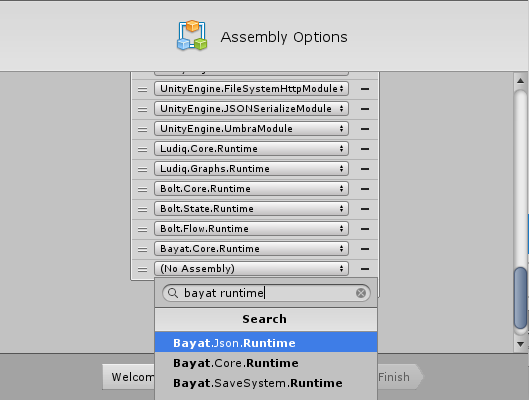
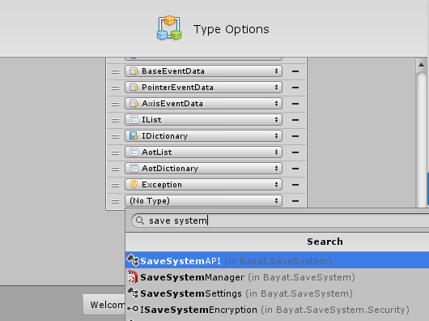

# Bolt Integration

The Bolt integration is fully automatic and is done by Bolt itself, you just need to make sure to include Bayat.SaveSystem, Bayat.Json and Bayat.Core assemblies in the assembly options of Bolt setup, then you can use the API through Bolt interface.

Then add the SaveSystemAPI:

You can add more classes as you desire, from storages, serialization, ... 

Learn more about Bolt installation:

- [Bolt Installation](https://ludiq.io/bolt/manual/introduction/installation)
- [Bolt Installation - Assemblies](https://ludiq.io/bolt/manual/introduction/installation#assemblies)