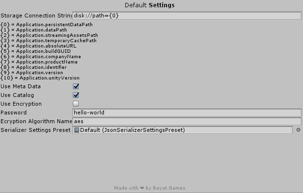
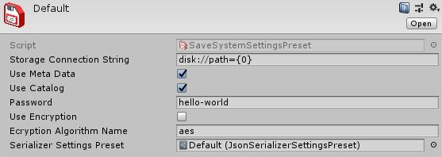

# Security

Encrypt your data and prevent cheaters from altering the game or app data, so they have to play the game in order to win!
The [AES encryption](https://en.wikipedia.org/wiki/Advanced_Encryption_Standard) is included as built-in so you can easily use this advanced encryption algorithm to secure your data.

## Changing the Algorithm

You can change the encryption algorithm through different ways as below:

### Settings Preset

You can change the **Encryption Algorithm Name** field in Settings Preset file and then use it on your component or script, or apply it to an existing settings object.
Make sure to enable **Use Encryption** and also use a secure and strong **Password**.

You can also modify the default settings through **Window > Bayat > Save System > Default Settings**.



Also, the default settings preset file is located at **Plugins/Bayat/SaveSystem/Resources/Bayat/SaveSystem/Settings/Default**



### SaveSystemSettings (Programatic)

You can modify the [`SaveSystemSettings`](xref:Bayat.SaveSystem.SaveSystemSettings) object when you're passing it as an argument to the API or through the `DefaultSettings` property.

#### Passing as argument

```csharp
SaveSystemSettings settings = SaveSystemSettings.DefaultSettings.Clone();

// Enable encryption
settings.UseEncryption = true;

// Use a secure and strong password
settings.Password = "hello-world";

// Set the encryption algorithm or use the default encryption algorithm through SaveSystemSettings.DefaultEncryptionAlgorithm
settings.EncryptionAlgorithm = new MyCustomEncryptionAlgorithm();

SaveSystemAPI.SaveAsync("my-data.json", myData, settings);
```

#### Modifying the Default Settings

```csharp
SaveSystemSettings settings = SaveSystemSettings.DefaultSettings;

// Enable encryption
settings.UseEncryption = true;

// Use a secure and strong password
settings.Password = "hello-world";

// Set the encryption algorithm or use the default encryption algorithm through SaveSystemSettings.DefaultEncryptionAlgorithm
settings.EncryptionAlgorithm = new MyCustomEncryptionAlgorithm();
```