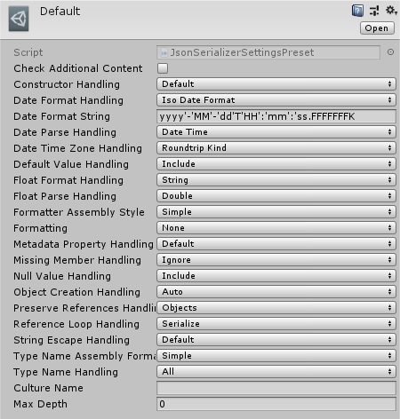

# Serialization

The save system uses a modified version of the popular [Newtonsoft Json.NET](https://www.newtonsoft.com/json) library, which provides a powerful, feature-rich and performant API for serialization.

For more information check out [Json.NET official documentation](https://www.newtonsoft.com/json/help/html/Introduction.htm).

## Features

- Serializes circular references
- Supports serializing objects by reference
- Deserializes polymorphic properties and collections
- Supports including type names with JSON
- Supports excluding null values when serializing
- Conditional property serialization
- Camel case JSON property names
- Non-default constructors support
- Supports populating an existing object
- Efficiently serializes byte arrays as base64 text
- Handles NaN, Infinity, -Infinity and undefined
- Handles JavaScript constructors
- Serializes ISerializable objects
- Supports serializing enums to their text name
- Attribute property name customization
- Attribute property order customization
- Attribute property required customization
- Supports ISO8601 dates
- Supports JavaScript constructor dates
- Unquoted property names support
- Raw JSON support
- Deserializes anonymous types
- Opt-in and Opt-out property serialization
- Efficiently stream reading and writing JSON
- Single or double quote JSON content
- Supports overriding a type's serialization
- Supports OnDeserialized, OnSerializing, OnSerialized and OnDeserializing attributes
- Supports serializing private properties
- DefaultValue attribute support
- Case-insensitive property deserialization
- Serializes read-only and immutable collections
- Supports serialization extension data
- Supports reading and writing comments
- Indented JSON output
- Serializes Unity objects with reference if available (using Scene Reference Resolver and Asset Reference Resolver)

## Configuration

You can change the serialization settings through [`JsonSerializerSettings`](xref:Bayat.Json.JsonSerializerSettings) or through the **Json Serializer Settings Preset**, which a Default preset is included.

### Preset



### Programatic

```csharp
void Start() {

    JsonSerializerSettings settings = SaveSystemSettings.DefaultJsonSerializerSettings;
    settings.Formatting = Formatting.Indented;

}
```

## Attributes

For more information about attributes, check out Json.NET official documentaiton.

[Learn more](https://www.newtonsoft.com/json/help/html/SerializationAttributes.htm)

## Conditional Property Serialization

For more information about conditional property serialization, check out Json.NET official documentaiton.

[Learn more](https://www.newtonsoft.com/json/help/html/ConditionalProperties.htm)